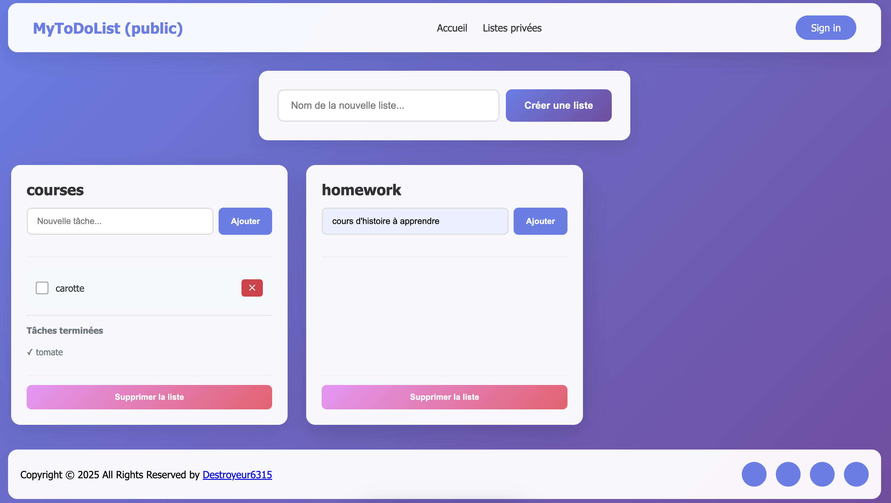

# 📸 Aperçu de l'application



---

# MyToDoList

Application web PHP simple permettant de créer et gérer des listes de tâches publiques et privées. Basée sur une architecture MVC (dossiers `Controleurs`, `Modeles`, `Vues`) avec un point d'entrée unique : `index.php`.

## ✨ Fonctionnalités principales

- Deux types d'acteurs : **Visiteur** et **Utilisateur** (connecté).
- Création / suppression de **listes** et de **tâches publiques**.
- L'utilisateur connecté peut créer/supprimer des **tâches privées**.
- Une tâche peut être **cochée** → elle devient « terminée » après validation :
  - Les tâches terminées apparaissent après les tâches actives.
  - Elles ne peuvent plus être modifiées.

## ✨ Fonctionnalités à venir

- Convertir une tâche privée en tâche publique.
- Créer un compte utilisateur.
- Utiliser des secrets pour les identifiants MySQL.
- Hacher le mot de passe dans la base de données pour plus de sécurité.
- Utiliser une authentification plus robuste comme JWT, OAuth2.0...

## 📁 Structure du projet

Voici une description rapide de l'utilité de chaque dossier du projet :

```
MyToDoList/
├─ Controleurs/   → Contient les fichiers responsables de gérer la logique entre les modèles et les vues.
├─ Modeles/       → Regroupe les classes permettant d'interagir avec la base de données.
├─ Vues/          → Contient les fichiers HTML/PHP affichés à l'utilisateur.
├─ index.php      → Point d'entrée unique de l'application (front controller).
└─ README.md      → Documentation du projet.
```

## 🛠️ Prérequis

- Seulement Docker

## 🐳 Lancement avec Docker

1. **Cloner :**

```
git clone https://github.com/Destroyeur6315/MyToDoList.git
cd MyToDoList
```

2. **Lancer les services Docker :**

```
docker compose up
```

3. **Exécuter le fichier setup.php pour créer la base de données :**

```
http://localhost:8080/setup.php
```

4. **Accéder à l'application :**

```
http://localhost:8080
```

Pour administrer la base de données :

- phpMyAdmin disponible sur : `http://localhost:8081`
- Identifiants : **user/password**

Compte utilisateur par défaut dans l'application :
- **Username :** user63
- **Password :** password63

## 📜 Licence

MIT licence.

## 👤 Auteur

**Destroyeur6315**

