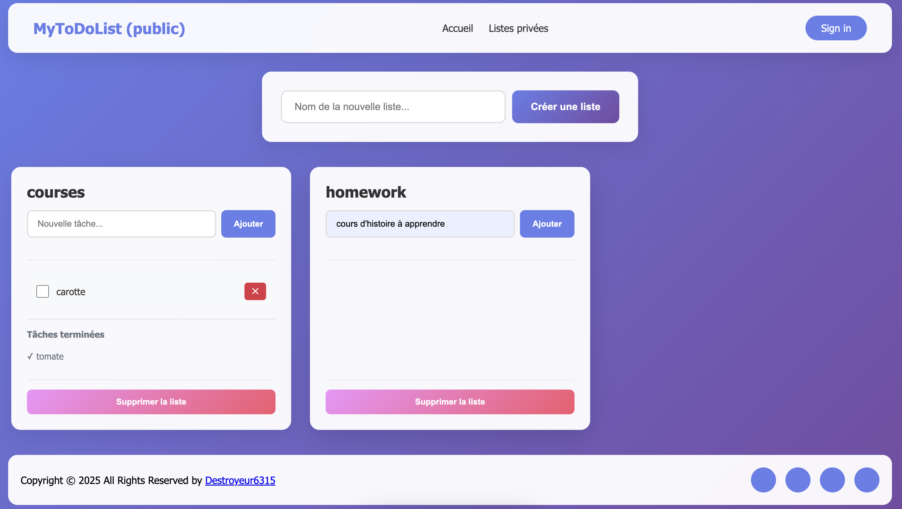
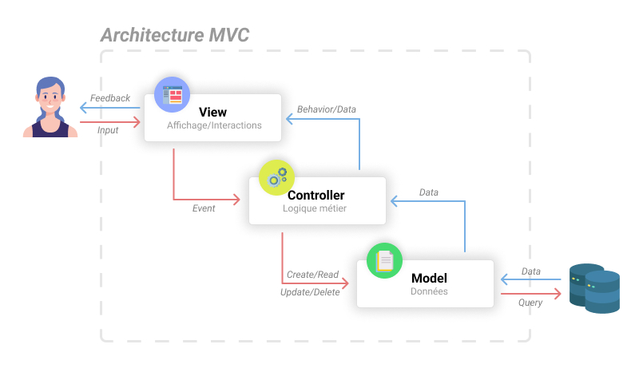

# 📸 Aperçu de l'application



---

# MyToDoList

Application web PHP simple permettant de créer et gérer des listes de tâches publiques et privées. Basée sur une architecture MVC (dossiers `Controleurs`, `Modeles`, `Vues`) avec un point d'entrée unique : `index.php`.

## 🧱 Architecture MVC

L’application suit une architecture **MVC** (**Modèle - Vue - Contrôleur**), un modèle d’organisation très utilisé dans le développement web.



### 📖 Qu’est-ce que le MVC ?

Le MVC sépare une application en trois parties distinctes :

- **Modèle (Model)** : gère les données et les interactions avec la base de données.
- **Vue (View)** : affiche les informations à l’utilisateur.
- **Contrôleur (Controller)** : fait le lien entre la vue et le modèle, et gère la logique métier.

Concrètement :
- l’utilisateur interagit avec la **Vue** ;
- la **Vue** transmet l’action au **Contrôleur** ;
- le **Contrôleur** demande au **Modèle** de lire ou modifier les données ;
- le **Modèle** renvoie les résultats ;
- le **Contrôleur** retourne ensuite une **Vue** mise à jour.

### ✅ Pourquoi utiliser MVC ?

Utiliser MVC présente plusieurs avantages :

#### 1. Une meilleure organisation du code
Chaque partie de l’application a un rôle précis.  
Cela évite de mélanger l’affichage, la logique métier et l’accès aux données dans un seul fichier.

#### 2. Une maintenance plus simple
Quand le projet grandit, il devient plus facile de retrouver où modifier une fonctionnalité :
- dans le **Modèle** pour les données,
- dans la **Vue** pour l’affichage,
- dans le **Contrôleur** pour le traitement.

#### 3. Une évolution plus facile
Cette séparation permet d’ajouter de nouvelles fonctionnalités plus proprement, sans casser tout le reste de l’application.

#### 4. Un code plus lisible et réutilisable
Le code est plus clair, donc plus simple à comprendre, à tester et à réutiliser dans d’autres parties du projet.

#### 5. Une bonne pratique pour apprendre le développement web
Le MVC est une architecture très répandue dans de nombreux frameworks et projets professionnels.  
L’utiliser dans ce projet permet donc d’adopter de bonnes habitudes dès le départ.

## ✨ Fonctionnalités principales

- Deux types d'acteurs : **Visiteur** et **Utilisateur** (connecté).
- Création / suppression de **listes** et de **tâches publiques**.
- L'utilisateur connecté peut créer/supprimer des **tâches privées**.
- Une tâche peut être **cochée** → elle devient « terminée » après validation :
  - Les tâches terminées apparaissent après les tâches actives.
  - Elles ne peuvent plus être modifiées.

## ✨ Fonctionnalités à venir

- Convertir une tâche privée en tâche publique.
- Créer un compte utilisateur.
- Utiliser des secrets pour les identifiants MySQL.
- Hacher le mot de passe dans la base de données pour plus de sécurité.
- Utiliser une authentification plus robuste comme JWT, OAuth2.0...

## 📁 Structure du projet

Voici une description rapide de l'utilité de chaque dossier du projet :

```
MyToDoList/
├─ Controleurs/   → Contient les fichiers responsables de gérer la logique entre les modèles et les vues.
├─ Modeles/       → Regroupe les classes permettant d'interagir avec la base de données.
├─ Vues/          → Contient les fichiers HTML/PHP affichés à l'utilisateur.
├─ index.php      → Point d'entrée unique de l'application (front controller).
└─ README.md      → Documentation du projet.
```

## 🛠️ Prérequis

- Seulement Docker

## 🐳 Lancement avec Docker

1. **Cloner :**

```
git clone https://github.com/Destroyeur6315/MyToDoList.git
cd MyToDoList
```

2. **Lancer les services Docker :**

```
docker compose up
```

3. **Exécuter le fichier setup.php pour créer la base de données :**

```
http://localhost:8080/setup.php
```

4. **Accéder à l'application :**

```
http://localhost:8080
```

Pour administrer la base de données :

- phpMyAdmin disponible sur : `http://localhost:8081`
- Identifiants : **user/password**

Compte utilisateur par défaut dans l'application :
- **Username :** user63
- **Password :** password63

## 📜 Licence

MIT licence.

## 👤 Auteur

**Destroyeur6315**

